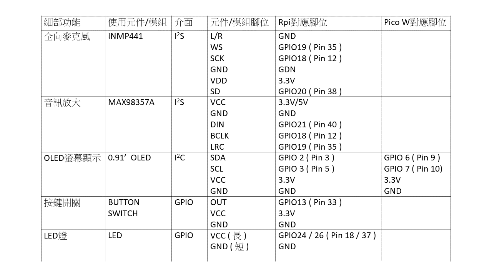
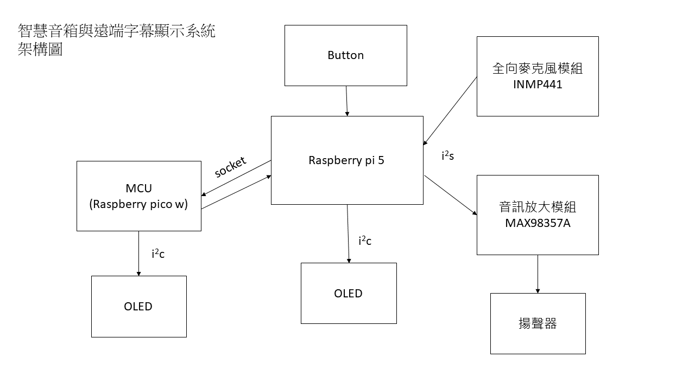
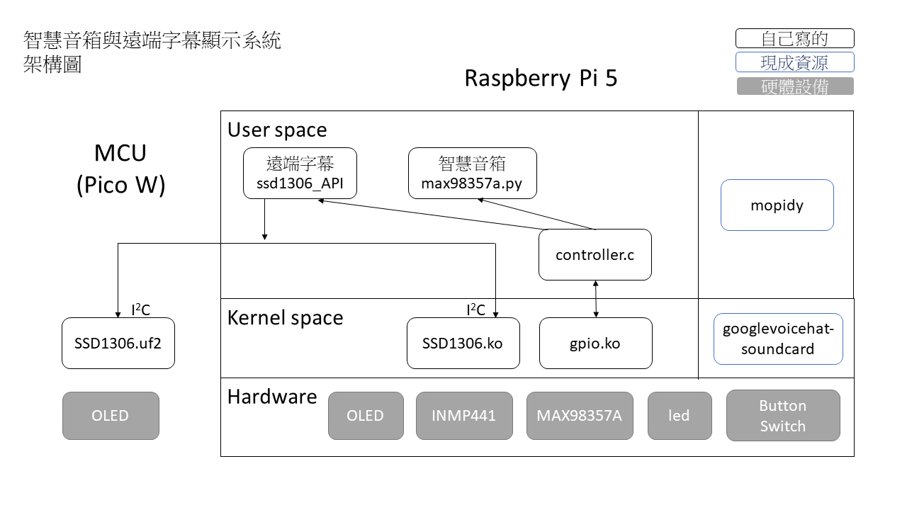

# 智慧音箱與遠端字幕顯示系統  
**Sound Box and Remote Display System**

---

## 專案簡介
本系統是一個基於樹莓派（Raspberry Pi 5）與 MCU（Raspberry Pi Pico W）所建構的嵌入式裝置，透過音訊處理、語音辨識與無線傳輸，提供結合娛樂與無障礙資訊的應用服務。

使用者透過按鍵進行功能切換，配合 LED 指示當前狀態。系統藉由 Wi-Fi 串流與 I2C 傳輸，將語音與文字資訊傳送至遠端顯示設備，實現日常播放音樂與緊急字幕提示等功能。

---

## 功能介紹

### 智慧音箱
- 使用 INMP441 全向麥克風將音訊輸入至 Raspberry Pi
- 語音辨識轉換為文字
- 透過 Mopidy（MPD）搜尋歌曲
- 音訊經由 MAX98357A 放大後由喇叭播放

### 遠端字幕
- 使用 INMP441 全向麥克風將音訊輸入至 Raspberry Pi (本地)
- 將語音轉文字後存檔
- 透過 I2C 傳送至本地端 SSD1306 OLED 
- 透過 Wi-Fi 傳送至遠端 MCU OLED (TCP server)

### OLED顯示
- 本地端為Linux character device driver，遠端為MCU裸機開發
- 可顯示英文字幕
- 透過ioctl()可控制螢幕亮度
- 透過mmap()模擬MMIO機制，搭配ioctl()可讓使用者輸入bitmap圖片並顯示於OLED

---

## 系統架構

### 硬體準備
- INMP441 全向麥克風
- MAX98357A 音訊放大器
- SSD1306 (128 x 32) OLED 顯示器
- Button Switch 按鍵開關
- LED 指示燈
- 3W 4Ω 小型揚聲器

### 設備連接
請參考以下接線圖：

### 系統建置

#### Raspberry Pi 5
- 系統版本：`Linux raspberrypi 6.6.51+rpt-rpi-2712`
- 系統架構：`ARMv8-A`（aarch64）

#### Raspberry Pi Pico W（RP2040）
- MCU 架構：`ARMv6-M`

### 架構圖

---

## 本系統與Ci1562共同協作
[Ci1562]( https://github.com/Ci1562/sound_box)

## 參考資源:
- pico-ssd1306：https://github.com/daschr/pico-ssd1306/tree/main
- ssd1306 OLED driver: https://www.cnblogs.com/zyly/p/17146122.html
- pico w TCP server: https://github.com/raspberrypi/pico-examples/blob/master/pico_w/wifi/tcp_server/picow_tcp_server.c

